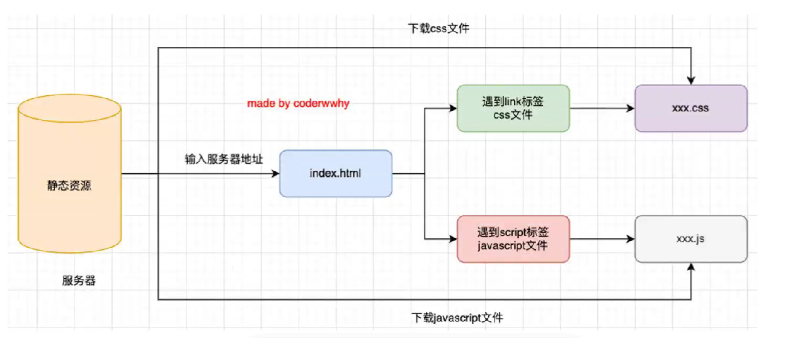
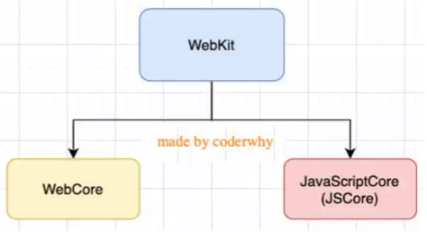
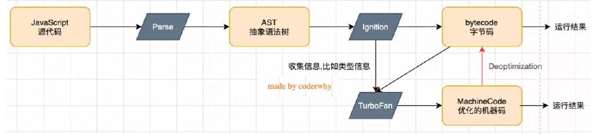
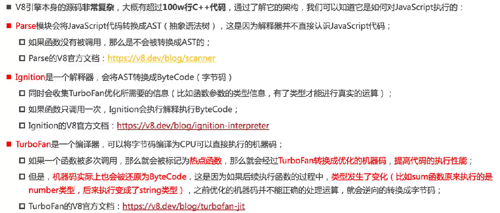

# 浏览器工作原理
## JavaScript如何在浏览器运行

## 认识浏览器内核

* 以WebKit为例，WebKit事实上由两部分组成：
  * WebCore:负责HTML解析、布局、渲染等相关工作；
  * JavascriptCore(引擎，还有Google开发的V8引擎)：解析、执行Javascript代码；

## 执行JavaScript的强大引擎
    可用于chrome和Node.js，是Javascript和WebAssembly引擎。

