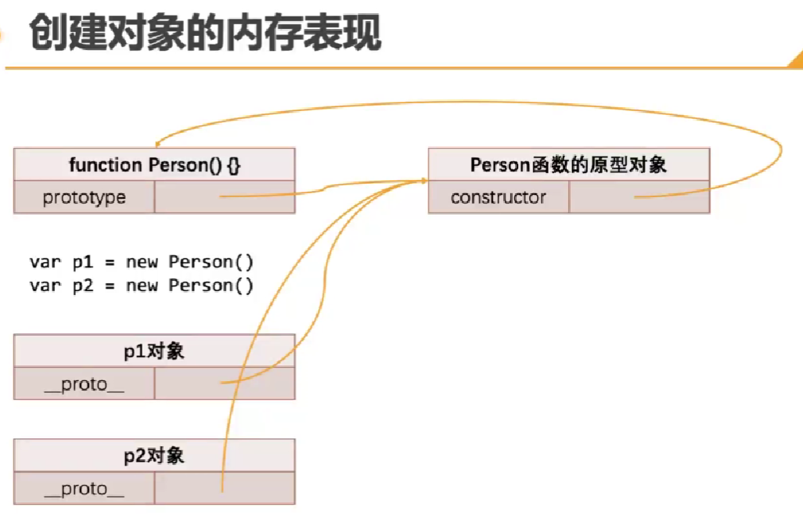

# new操作符调用的作用

  如果一个函数被new操作符调用了，那么它会执行如下操作：
    
    1.在内存中创建一个新的对象(空对象);
    2.这个对象内部的[[prototype]]属性会被赋值为该构造函数的prototype属性;
    3.构造函数内部的this，会指向创建出来的新对象;
    4.执行函数内部的代码（函数体代码）;
    5.如果构造函数没有返回的非空对象，则返回创建出来的新对象;
  
