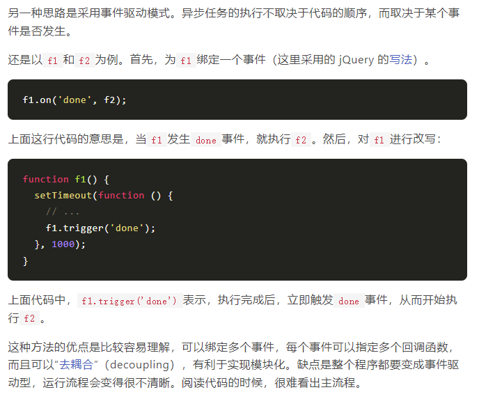

# 异步操作模式
## 回调函数
```javascript
	function f1(callback){
	// ...
	callback();
	}
	function f2(){
	//...
	}
	f1(f2);
```
上面代码可以保证`f1`执行后才执行`f2`,这时，f2为f1的回调函数。

回调函数的优点是简单、容易理解和实现，缺点是不利于代码的阅读和维护，各个部分之间高度耦合（coupling），使得程序结构混乱、流程难以追踪（尤其是多个回调函数嵌套的情况），而且每个任务只能指定一个回调函数。

## 事件监听


##  发布/订阅


## 异步操作流程控制
如果有多个异步任务，需要控制异步任务执行的顺序。


### 串行执行
编写一个流程来控制函数，完成以一个任务后，再执行另一个,这叫做串行执行。
```javascript
	let items = [1,2,3,4,5,6];
	let results  = [];
	function async(arg,callback) {
	console.log('参数为' + arg + ', 一秒后返回结果');
	serTimeout(funtion() {callback(arg * 2);}, 1000);
	}
	function final(value){
	console.log(value);
	}
	function series(item) {
	if(item) {
	async(item,function(result){
		results.push(result);
		return serries(items.shift());
	});
	}else{
	return final(results[results.length -1]);
	}
	}
	
	series(items.shift());
```
### 并行执行
流程控制函数也可以并行执行，即是所有异步任务执行完成后，才执行final函数。
```javascript
let items = [ 1, 2, 3, 4, 5, 6 ];
let results = [];

function async(arg, callback) {
  console.log('参数为 ' + arg +' , 1秒后返回结果');
  setTimeout(function () { callback(arg * 2); }, 1000);
}

function final(value) {
  console.log('完成: ', value);
}

items.forEach(function(item) {
  async(item, function(result){
    results.push(result);
    if(results.length === items.length) {
      final(results[results.length - 1]);
    }
  })
});
```
### 并行与串行的结合
```javascript
var items = [ 1, 2, 3, 4, 5, 6 ];
var results = [];
var running = 0;
var limit = 2;

function async(arg, callback) {
  console.log('参数为 ' + arg +' , 1秒后返回结果');
  setTimeout(function () { callback(arg * 2); }, 1000);
}

function final(value) {
  console.log('完成: ', value);
}

function launcher() {
  while(running < limit && items.length > 0) {
    var item = items.shift();
    async(item, function(result) {
      results.push(result);
      running--;
      if(items.length > 0) {
        launcher();
      } else if(running == 0) {
        final(results);
      }
    });
    running++;
  }
}

launcher();
```