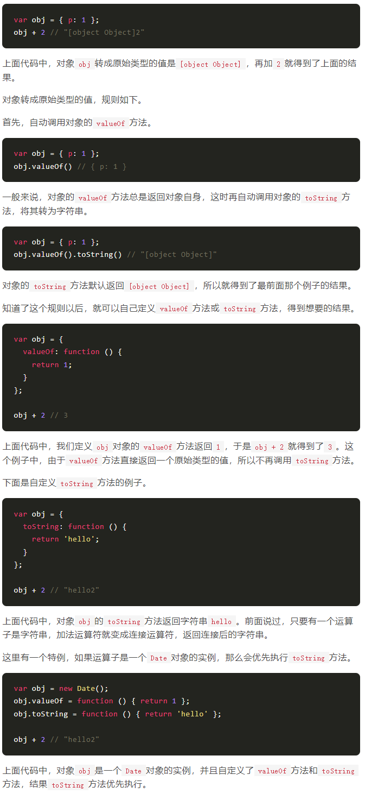
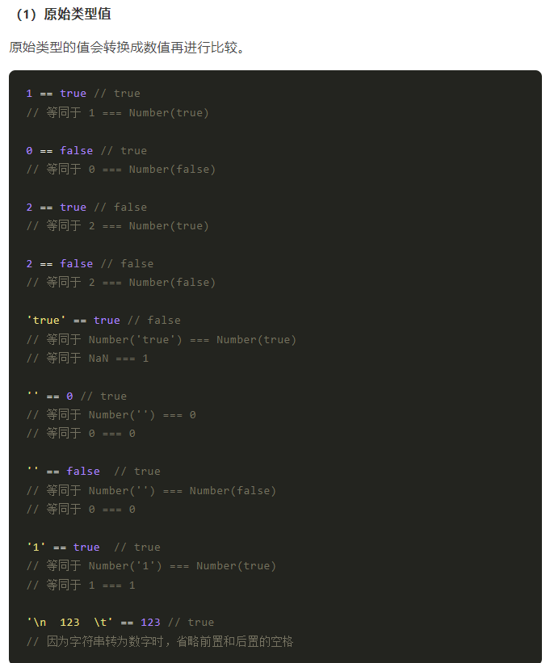

# 运算符
## 算数运算符
10种运算符，记住除法运算符 `x / y`,余数运算符`x % y`。
### 加法运算符
`+`是最常见的运算符，用于数值求和。
JavaScript允许非数值相加。
1. ```ture + true //2 ``` 布尔值相加，会先转为数值后相加。
2. 如果是两个字符串，会将两个字符串连接在一起，返回一个新的字符串。
	如果一个运算子是字符串，一个是非字符串，这时非字符串会转为字符串，再连接。
```javascript
	1 + 'a' //"1a"
	false + 'a' //"falsea"
```
加法运算符在运行时，决定相加还是连接，这种现象称为”重载“。要特别注意。
```javascript
'3' + 4 + 5 //"345"
3 + 4 + '5'//'75'
```
3. 其它运算符都是先转为数值再运算。
### 对象的相加
如果是运算子是对象，必须先转为原始类型的值，然后再相加。

### 余数运算符
### 数值运算符，负数值运算符
### 指数运算符
### 赋值运算符

## 比较运算符
比较运算符用于比较两个值的大小，然后返回一个布尔值，表示是否满足指定的条件。
JavaScript提供了8种比较运算符。
* `>` 大于运算符
* `<` 小于运算符
* `<=` 小于或等于运算符
* `>=` 大于或等于运算符
* `==` 相等运算符
* `===` 严格相等运算符
* `!=` 不相等运算符
* `!==` 严格不相等运算符

### 严格相等运算符
JavaScript提供两种相等运算符：`==`和`===`。
`===`判断是否为”同一个值“。
`==`会先把值转为同一类型，再进行比较。
1. 如果两个值的类型不一致，直接返回`false`。
```javascript
1 === '1' //false
true === 'true' //false
```
NaN与任何值都不相等，包括它自身。
2.复合类型值
两个复合类型（对象、数组、函数）的数据比较时，不是比较它们的值是否相等，而是比较它们是否指向同一个地址。
```JavaScript
{} === {} // false
[] === [] // false
(function () {} === function () {}) // false
```
3.`undefined`和`null`
`null`和`undefined`与自身严格相等。

### 相等运算符



## 布尔运算符
布尔运算符用于将表达式转为布尔值，一共包含四个运算符。

* 取反运算符：`!`
* 且运算符：`&&`
* 或运算符：`||`
* 三元运算符：`?:`

### 取反运算符
```javascript
!false //true
!true //false
```
对于非布尔值，取反运算符会将其转为布尔值。可以这样记忆，以下六个值取反后为true，其他值都为false。

* `undefined`
* `null`
* `false`
* `0`
* `NaN`
* `空字符串（''）`

## 二进制位运算符（TO DO）
## 运算优先级
不建议直接把所有运算符优先级都记住！
[参考链接](https://developer.mozilla.org/zh-CN/docs/Web/JavaScript/Reference/Operators/Operator_Precedence)


